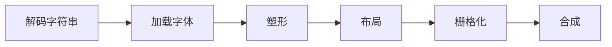

# 地狱难度的文字渲染


---
layout: intro
---
# 文字渲染有多难

<div></div>

从计算机有屏幕开始，在终端、软件、文档或网页中，文字都是界面中最基本的构成之一。能够正确的显示用户提供的任意文本是最基本的需求。

但就是这最基本的需求，实际上没有任何系统可以真正“完美”的显示文本，正确的渲染文字非常困难。

---

# 为什么要研究文字渲染

<br/>

* **文字很重要** 

  页面上最多的元素是文字。

* **实现自渲染** 

  为了跨平台今天有很多独立于操作系统的渲染引擎（Flutter），如果你要实现一个渲染引擎，文字渲染可能是引擎最复杂的部分。

* **字体技术在发展** 

  近些年字体和 [CSS Text Module](https://www.w3.org/TR/css-text-3/) 发展迅速，我们将有机会在浏览器中控制到文字渲染的细节，这需要我们理解文字渲染的原理。

---
layout: intro
---

## 文字渲染流程

<div class="text-base pt-6 flex-grow flex justify-center">



</div>

---
layout: intro
---

# 字体

## Typeface

---

# 字体

## 渲染类型
<br/>

- 点阵字体（位图字体）
- 矢量字体

---
layout: intro
---

# 点阵字体

---

# 世界上第一款中文字体

<div class="flex h-110">
<div class="flex flex-col w-4/10">


</div>

</div>

---

# 点阵字体的优势

- 渲染速度极快且简单
- 更容易制作。
- 始终提供完全相同的显示效果。
- 经过优化可以极小尺寸的显示器上清晰的显示字形

---

分别在 `windows` 和 `macos` 下使用 `simsun` 字体绘制 `12px` 的文字

<h3 class="pb-4">点阵字体</h3>


<h3 class="pb-4">矢量字体</h3>


---

# 点阵字体至今依然在 windows 上使用

<div class="flex flex-row items-center h-80">
  <div class="flex-grow p-4">

  ``` js
  let ctx = document.getElementById('canvas').getContext('2d');
  let y = 10;
  for(let i = 11; i < 20; i++) {
    ctx.font = `${i}px simsun`;
    ctx.fillText(`赢膏矗 ${i}px`, 0, y += i);
  }
  ```

  </div>
  
</div>

---

# 极限小的点阵字体

<div class="flex flex-row">
<div class="w-1/2">

### 丁卯点阵体 7x7

<br/>


</div>
<div class="w-1/2 flex flex-col">
<div class="h-1/2">

### CG Pixel 3x5

<br/>

</div>
<div class="h-1/2">

### 美咲フォント 8x8

<br/>

</div>

</div>
</div>

---

## 今天的点阵字体

<div class="flex flex-row items-start">

<div class="w-1/2 p-4">
<h3>点阵屏</h3>

</div>
<div class="w-1/2 p-4">
<h3>像素风游戏</h3>

</div>
</div>

---
layout: intro
---

# 矢量字体

---

# 矢量字体

<div></div>

矢量字体是与点阵字体相对应的一种字体。矢量字体的每个字形都是通过数学方程来描述的，一个字形上分割出若干个关键点，相邻关键点之间由一条光滑曲线连接。

矢量字的好处是字体可以无级缩放而不会产生变形。

### 在 figma 中可以看到矢量字体的关键点


今天常见的矢量字体格式有 `OpenType` 和 `TrueType`。

---

# 字体

## 文件格式
<br/>

- TrueType（ttf）
- OpenType（otf）
- WebFont（woff1/2）

<br/>

```css
@font-face {
  font-family: bodytext;
  src: url(sans-serif.woff2) format("woff2"),
       url(sans-serif.woff) format("woff"),
       url(sans-serif.otf) format("opentype"),
       url(sans-serif.ttf) format("truetype");
}
```

---

# TrueType 字体

<div></div>

`TrueType` 的文件后缀是 `.ttf`，Windows 上的字体基本上都是 `TrueType` 格式。

一个 `TrueType` 文件可以同时包含点阵字体和矢量字体，并且允许开发者根据不同的字体大小调用不同的字形。

<div class="flex flex-row flex-wrap">

<div class="w-1/2 pb-5 flex flex-col items-center">

<span class="text-sm text-gray-400 pt-2">Windows 内置字体大多是 TrueType 格式。</span>
</div>

<div class="w-1/2 pb-5 flex flex-col items-center">

<span class="text-sm text-gray-400 pt-2">根据不同的字体大小调用不同的字形</span>
</div>

</div>

---

# OpenType 字体

<div></div>

`OpenType` 也可以叫做 `TrueType2.0`, 和 `TrueType` 大部分定义都是一样的，`OpenType` 的国际化功能比 `TrueType` 强大。

`OpenType` 的文件后缀是 `.otf`, 目前的 `OpenType` 已经成为 `ISO` 的公开标准。

<div class="flex flex-row flex-wrap">

<div class="w-1/2 pb-5 flex flex-col items-center">

<span class="text-sm text-gray-400 pt-2">OpenType 可变字体</span>
</div>

<div class="w-1/2 pb-5 flex flex-col items-center">
<div class="text-5xl pb-4">
द् + ध् + र् + य = द्ध्र्य
</div>
<span class="text-sm text-gray-400 pt-2">OpenType 连字功能</span>
</div>

</div>

---


# 字体功能 · 可变字体

<br/>

<p id="variable-fonts" style="font-size: 5em; line-height: 1; font-family: 'Amstelvar VF'; font-variation-settings: 'wght' var(--text-axis);">
Width
</p>

<input oninput="document.getElementById('variable-fonts').style.setProperty('--text-axis', this.value)" class="pb-10" type="range" value="625" id="text-axis" min="300" max="900" />

``` css
font-variation-settings: 'wght' var(--text-axis);
```

---

# 字体功能 · 简繁转换

<br/>

<p style="font-size: 5em; line-height: 1; font-family: 'kozuka-mincho-pr6n-1';">台</p>
<p style="font-size: 5em; line-height: 1; font-family: 'kozuka-mincho-pr6n-1'; font-feature-settings: 'trad';">台</p>

```css
font-feature-settings: 'trad';
```

---

# 字体功能 · 半角标点

<br/>

<p style="font-size: 2em; line-height: 1; font-family: 'kozuka-mincho-pr6n-1';">你好、『世界』。</p>
<p lang="ja" style="font-size: 2em; line-height: 1; font-family: 'kozuka-mincho-pr6n-1';font-feature-settings: 'halt';">你好、『世界』。</p>

```css
font-feature-settings: 'halt';
```
---

# 字体功能 · 连字

<br/>

<p style="font-size: 5em; line-height: 1;font-feature-settings: 'liga' 0;">ffi</p>
<p style="font-size: 5em; line-height: 1;">ffi</p>

```css
font-feature-settings: 'liga' 0; /* 关闭连字 */
```

---

# 字体功能 · 本地化

<br/>

### 俄语
<p style="font-size: 5em; line-height: 1; font-family: 'of-sf-pro-display';" lang="ru">гпклдвзитжц</p>

### 保加利亚语
<p style="font-size: 5em; line-height: 1; font-family: 'of-sf-pro-display';" lang="bg">гпклдвзитжц</p>

```html
<p lang="ru">гпклдвзитжц</p>
<p lang="bg">гпклдвзитжц</p>
```

---

<h1>字体功能 <span v-click>· 小型大写字母</span></h1>

<div></div>


<div v-after>

iPhone X<span style="font-variant-caps: all-small-caps;">R</span> 的 <span style="font-variant-caps: all-small-caps;">R</span> 明显比较小，但他依然是大写的。这不是简单的缩放，Apple 使用了 css 设置了 `font-variant-caps: all-small-caps;`，调用了字体的小型大写字母功能，在支持的字体中会有单独设计的字形。


</div>

---

# WOFF 字体

<div></div>

WOFF 是一种专为网页设计的字体格式标准，由 W3C 标准化，现在已经是推荐标准。

WOFF 与其说是一种字体格式，实际上只是一种容器格式，WOFF 只是将 `TrueType` 或 `OpenType` 字体（这 2 种字体数据格式几乎一样）重新打包并压缩而已。

WOFF 体积比不压缩的字体格式要小得多，便于在网页中使用。 WOFF 1.0 采用 `gzip` 压缩一般可以压缩 40%，WOFF 2.0 使用 `Brotli` 压缩体积还要小 30%。

---

# 字体管理器

应用程序通常使用字体管理器获取字体，字体管理器通常由操作系统提供，用于管理系统字体。

* Windows: DirectWrite
* MacOS / iOS: CoreText
* Android: minikin
* linux: fontconfig


<!-- http://androidxref.com/9.0.0_r3/xref/frameworks/minikin/libs/minikin/FontCollection.cpp#417 -->

---

字体管理器会给应用程序提供查找字体的接口，接口通常如下

``` csharp
Typeface MatchCharacter(string familyName, FontStyle style, string[] locale, char character)
```

<br/>

现实世界的文本通常混合了不同字体，也可以在一段文字中包含不同的样式。应用程序通常使用一个叫 `TextRuns` 的迭代器来处理文本流。

### TextRuns

```js {all|1|2|3|5|all}
while (ch = nextChar()) {
  if (typeface?.has(ch)) {
    yield typeface;
  } else {
    yield typeface = fontMgr.MatchCharacter(familyName, style, locale, ch);
  }
}
```

---
layout: intro
---

# 文字塑性

---

# 文字不是单个字符

<div></div>

在英语和中文里每个字符就是一个字，但有些语言完全依赖连字。

例如：

<p style="font-size: 5em; line-height: 1;">ड्ड بسم</p>

拆开来单个字符是

<p style="font-size: 5em; line-height: 1;">ड् ड ب س م</p>

<br/>

**结论：字符的形状取决于它周围的字符！**

---

# 文字塑形 (text shaping)

<div></div>

从找到文本中每个字所对应的字形，这个过程就叫文字塑性。

OpenType 有一份[文字塑性规范文档](https://github.com/n8willis/opentype-shaping-documents)，非常复杂，里面针对一些小语种有额外的处理规则。

文字塑形非常复杂，必须得用一个塑形库。
# [HarfBuzz](https://harfbuzz.github.io/)

<div></div>

HarfBuzz 是一个文字塑性库，只需要输入一个字体和一串 Unicode 字符串就可以得到对应的正确排列的字形序列和对应字形应该放置的位置。

HarfBuzz 被用于 Firefox，GNOME，ChromeOS，Chrome，LibreOffice，XeTeX，Android 和 KDE 等。


---
layout: fact
---

# 布局

<div></div>

在实际使用中的文本并不是一行从左向右排到底的，有一系列布局规则。

通常需要根据容器的大小控制文字断行。不同的语言不同的国家还有不同的排版规范。

<br/>
<br/>

<span style="display: inline-block; width: 500px; border: 2px solid #888; padding: 0px; margin: 0px; line-height: 1.6; opacity: 0.5; text-align: left">
Blender is the free and open source 3D creation suite. It supports the entirety of the 3D pipeline—modeling, rigging, animation, simulation, rendering, compositing and motion tracking, even video editing and game creation. Advanced users employ Blender’s API for Python scripting to customize the application and write specialized tools; often these are included in Blender’s future releases. Blender is well suited to individuals and small studios who benefit from its unified pipeline and responsive development process. Examples from many Blender-based projects are available in the showcase.
<br/>
Blender is cross-platform and runs equally well on Linux, Windows, and Macintosh computers. Its interface uses OpenGL to provide a consistent experience. To confirm specific compatibility, the list of supported platforms indicates those regularly tested by the development team.
</span>

---

# 自动断行算法

Unicode 定义了一堆换行规则 [(UAX #14)](http://unicode.org/reports/tr14/)，定义了换行机会和禁止换行规则，排版引擎只能在换行机会的时候执行换行。以下是一些例子

## 换行机会

- 空格<code>&nbsp;</code>或连字符`-`之后能够换行
- 数字加减乘除后面能够换行
- 泰语等不使用空格的语言，需要分析音节边界进行换行

## 禁止换行

* 不换行特殊字符的前后 `&NoBreak;` `&nbsp;` 等等
* 数字的小数点`.`和负号`-`，百分号`%`，或表示单位的`$``¥`等。
* ...

---

# 高级排版

<div></div>

大多数文字都是从左到右的书写习惯，少数文字是从右到左的书写方式比如阿拉伯文希伯来文。

当字符串中出现混合的阿拉伯文、英文字母、数字以及标点符号就需要使用 [Unicode 双向算法](https://unicode.org/reports/tr9/) 对文字进行重新排序。

比如一段电话号码：

<p style="font-size: 2em; line-height: 1;">‎(+86)138-3456-1000</p>

当我们在电话号码前面加一段阿拉伯语ولدت整个电话号码都会被重新排序：

<p style="font-size: 2em; line-height: 1;">‎ولدت (+86)138-3456-1000</p>

<br/>
<br/>

由于规则过于复杂，这里推荐使用开源库 [ICU](http://site.icu-project.org/) 进行处理。

---
layout: cover
---

# 渲染

---

# 栅格化

<div></div>

矢量字体每个字形都是由若干条线条组成，但我们的显示屏是由像素点组成的。将矢量字形转换为屏幕上显示图像的过程叫做栅格化。


<br/>
<br/>

# [FreeType](https://www.freetype.org/)

<div></div>

FreeType 是一个字体栅格化库，能够处理 TrueType、OpenType 的矢量字体。FreeType 被用于 Android，ChromeOS 和各类 Linux 发行版中。

---

# 抗锯齿

在低分辨率下，文字很小，栅格化通过抗锯齿显示更多细节。

灰度抗锯齿在字体边缘让像素透明，看起来就像覆盖了一半的感觉。

次像素抗锯齿更加极端，利用显示器每个像素有红绿蓝三个子像素的原理，单独控制子像素，获得三倍的分辨率提升。代价是字体边缘看起来会有彩边。

<div class="flex flex-row flex-wrap">

<div class="w-1/2 pb-5 flex flex-col items-center">

<span class="text-sm text-gray-400 pt-2">灰度抗锯齿</span>
</div>

<div class="w-1/2 pb-5 flex flex-col items-center">

<span class="text-sm text-gray-400 pt-2">次像素抗锯齿</span>
</div>

</div>

---

# hinting 渲染提示

<div></div>

在低分辨率下，hinting 功能可以使用一些指令对字体轮廓进行一些调整，使其与网格对其。能大大提高文字在低分辨率下的可读性。

hinting 实际上是内置于字体中的一段程序，栅格化的时候会被执行。优秀的字体会精心设计 hinting 程序。

<div class="flex flex-row flex-wrap">

<div class="w-1/2 pb-5 flex flex-col items-center">

<span class="text-sm text-gray-400 pt-2">没有 hinting 的字体</span>
</div>

<div class="w-1/2 pb-5 flex flex-col items-center">

<span class="text-sm text-gray-400 pt-2">有 hinting 的字体</span>
</div>

</div>
---

# 字体缓存

<div></div>

栅格化是相对比较慢的过程，渲染引擎应该尽可能缓存栅格化的结果。

这里选取比较典型的 `skia` （`Chrome` 和 `Android` 所用的底层绘图库）来做讲解。

在 `skia` 中字体缓存被实现为一个 `LRU` 缓存，`skia` 会给每个字形计算一个唯一的 `ID`，然后使用 (`ID` + 字体大小 + 字体样式) 做 `key` 将图像储存在缓存中。下次渲染到同样的字就可以直接从缓存中提取，不需要重新栅格化。

`skia` 默认的缓存大小是 `2MB`，考虑到文字是单色的，一个像素只需要一个字节，`2MB` 就足够缓存 `1920x1080` 的字形图像。

<!-- https://github.com/google/skia/blob/1f193df9b393d50da39570dab77a0bb5d28ec8ef/src/core/SkStrikeCache.cpp#L258 -->

---

# 字形缓存缺陷

<div></div>

`skia` 的字形缓存非常有效，但是仔细思考会发现一个小问题，对于同一个字形，每个字体大小都得重新渲染缓存。假如我们做一个文字放大的动画，字体大小每一帧都在变化，字体缓存就会失效。

<br/>

<div class="flex flex-col items-center">
<a target="_blank" href="/resize.html"></a>
<span class="text-sm pt-4 text-gray-400">在 Chrome(canvas) 中的字体放大动画只有 20 fps</span>
</div>

---

移动端浏览器上两指缩放，可以放大网页。所有文字也随之放大。

经过观察所有 Android 浏览器在快速放大时，文字会出现模糊现象。怀疑是在放大过程，只是通过插值将图像放大，并没有重新渲染。

但 iOS 没有观察到模糊现象。

 

---

# 论外：Apple CoreText

<div></div>

`MacOS` 和 `iOS` 应用程序使用 `Apple CoreText API` 来绘制字形，底层是一个叫作 `Quartz 2D` 的图像引擎。

应用程序不需要自己做栅格化，而是将矢量图像返回给 `Quartz 2D` 统一栅格化，`Quartz 2D` 栅格化速度非常快，动画也能非常流畅。

在 `Mac` 和 `iPhone` 上 `Safari` 浏览器中运行上面的文字放大测试，均能流畅 60 帧。

[Quartz 2D Graphics for Mac OS X Developers](https://flylib.com/books/en/3.310.1/)

---
layout: intro
---

# 合成

经过一顿操作，我们终于得到了文字渲染的结果，其他元素合成到一起输出最终画面。

---

# 总结：如何实现一个自渲染文本库

1. 解码要渲染的文本
2. 遍历文本，调用操作系统的字体管理器，获得每段对应的字体。
3. 调用 [HarfBuzz](https://harfbuzz.github.io/) 获得每个字对应的字形和每个字形的正确位置。
4. 调用 [ICU](http://site.icu-project.org/) 搭配自己写的算法，对文字进行排版。
5. 调用 [FreeType](https://www.freetype.org/) 把字形渲染成图像，放到排版对应位置。
6. 合成最终画面

---

<span style="font-size: 5em; line-height: 1.4; color: rgba(0,0,0,0.5);">मनीष منش</span>

<div style="font-size: 5em; line-height: 1.4;">
  <span style="color:red">ا</span><span style="color:green">ل</span><span style="color:blue">ل</span><span style="color:orange">ه</span>
</div>

<div style="font-size: 25px; line-height: 1.4">
<span style="writing-mode: vertical-lr">oh hey what?</span>
<span style="writing-mode: vertical-lr">oh <span style="color:#8A2BE2">لا بسم الله</span> no</span>
<span style="writing-mode:vertical-rl">你好<span style="text-combine-upright:all; color:red">1234</span>你好</span>
</div>